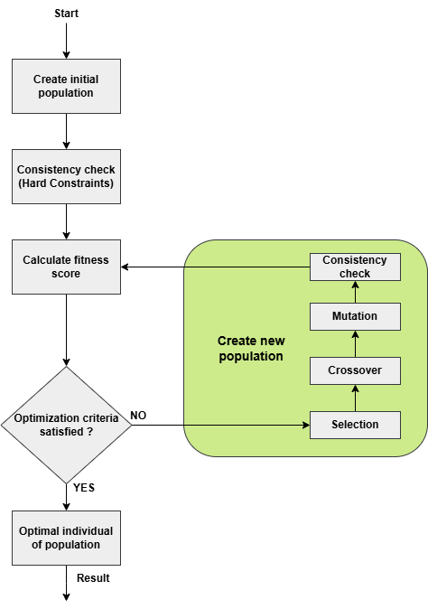

# Personnel Scheduling with Genetic Algorithm

## Overview
This project implements a **Genetic Algorithm (GA)** to solve a constraint satisfaction problem for scheduling the shifts of 30 employees over 14 days, based on the WHPP problem [1]. The algorithm ensures feasible schedules by meeting hard constraints defined by the employer and optimizes them by satisfying as many soft constraints as possible.

The Genetic Algorithm uses natural selection principles to iteratively improve the schedules, balancing diversity and convergence to achieve near-optimal solutions.

---

## Features
- **Constraint Satisfaction**: Handles both hard and soft constraints effectively.
- **Customizable Parameters**: Adjustable population size, number of generations, crossover, and mutation rates.
- **Optimized Scheduling**: Produces high-quality schedules efficiently using evolutionary techniques.

## Note
Achieving lower penalties in genetic algorithms can be approached through several strategies. This is just a basic implementation that uses specific methods regarding selection, crossover and mutation processes. To improve the performance of the genetic algorithm and potentially achieve lower penalties, one should:

**1. Tune Genetic Algorithm Parameters**: These involve *crossover probability*, *mutation probability*, *population size* and *number of iterations*.

**2. Selection Methods**: This implementation uses *Rank-Based Selection*. Others include *Tournament Selection* or *Roulette Wheel Selection*.

**3. Crossover Operators**: Here, we used *Uniform Crossover*. There is also an implementation of *Two-Point Crossover*.

**4. Mutation Operators**: *Random Mutation* is used and an implementation of *Cyclic Shift Mutation* can be found in the code.

**5. Elitism**: Preserve a certain number of the best individuals from one generation to the next to ensure that the best solutions are not lost (not implemented).

**6. Adaptive Parameters**: Adjust crossover and mutation probabilities dynamically based on the progress of the algorithm.

**7. Hybrid Approaches**: Combine genetic algorithms with other optimization techniques, such as local search, to refine solutions.

---

## Problem Constraints

### Hard Constraints
The following constraints **must be satisfied** to ensure a feasible schedule:

| Shift Type     | Monday | Tuesday | Wednesday | Thursday | Friday | Saturday | Sunday |  
|----------------|--------|---------|-----------|----------|--------|----------|--------|  
| Morning Shift  | 10     | 10      | 5         | 5        | 5      | 5        | 5      |  
| Afternoon Shift| 10     | 10      | 10        | 5        | 10     | 5        | 5      |  
| Night Shift    | 5      | 5       | 5         | 5        | 5      | 5        | 5      |  

### Soft Constraints
The following constraints **should be satisfied** to optimize the schedule. A penalty weight is assigned for each violation:

| Constraint                                           | Penalty Weight |  
|------------------------------------------------------|----------------|  
| Maximum 70 hours of work                             | 1000           |  
| Maximum 7 consecutive days of work                   | 1000           |  
| Maximum 4 consecutive night shifts                   | 1000           |  
| Avoid morning shift immediately after a night shift  | 1000           |  
| Avoid morning shift immediately after an afternoon shift | 800       |  
| Avoid afternoon shift immediately after a night shift | 800          |  
| At least 2 days off after 4 consecutive night shifts | 100            |  
| At least 2 days off after 7 consecutive workdays     | 100            |  
| Avoid work-day off-work patterns                     | 1              |  
| Avoid day off-work-day off patterns                  | 1              |  
| At most one weekend of work                          | 1              |  

---

## Algorithm Workflow
1. **Initial Population**: A set of feasible schedules is generated.
2. **Fitness Evaluation**: Each schedule is scored based on how well it satisfies constraints.
3. **Selection**: The fittest schedules are chosen for reproduction.
4. **Crossover**: Schedules are combined to produce new ones, maintaining feasibility.
5. **Mutation**: Random changes are applied to ensure diversity.
6. **Termination**: The process stops when the global optimum is reached or after a set number of generations.



---

## Installation
1. Clone this repository:
   ```bash
   git clone https://github.com/dkomni/genetic-algorithm-scheduling

2. Compile the code using JDK version 14 or later:
   ```bash
   javac GA_main.java Population.java Individual.java Fitness.java

3. Run the program:
   ```bash
   java GA_main

   Optional: Pass custom parameters:
   java GA_main -i <populationSize> <iterMax> <pCross> <pMut>

## Future Enhancements
- Add visualization for schedules.
- Extend support for multi-objective optimization.
- Integrate more complex real-world constraints.

## Authors
- Komninos Dimitrios
- Kastellakis Antonios

## References
[1] Weil, G., K. Heus, P. Francois, and M. Poujade, Constraint programming for Nurse scheduling, in IEEE
Engineering in Medicine and Biology, 1995, p. 417–422.
